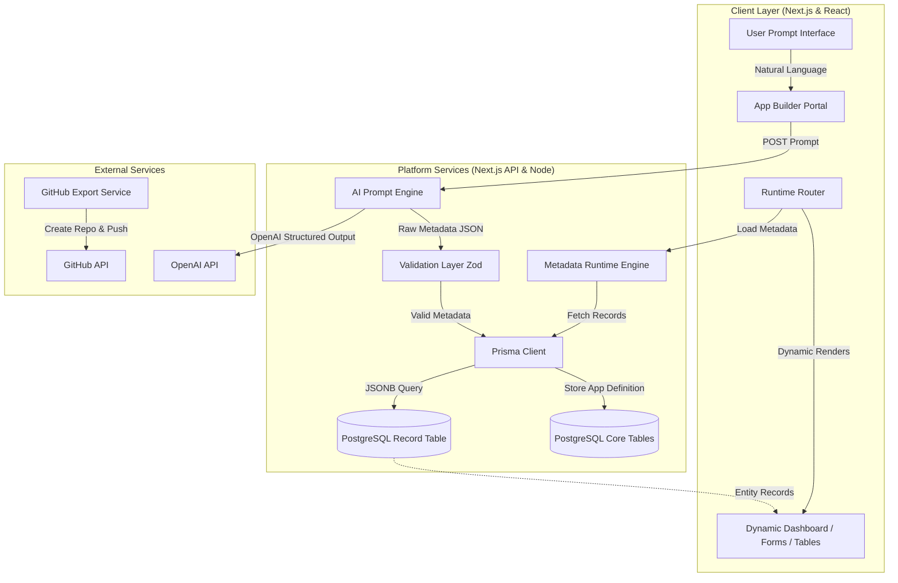
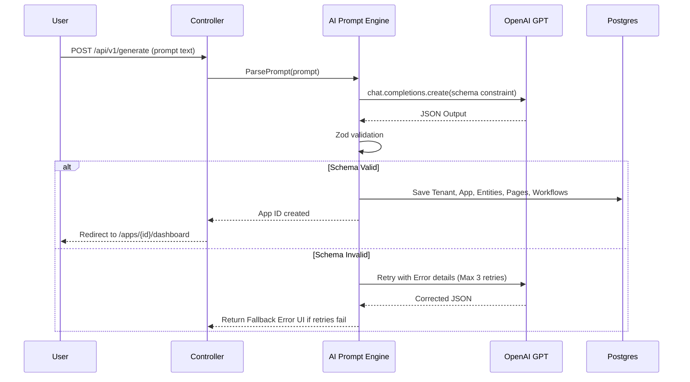
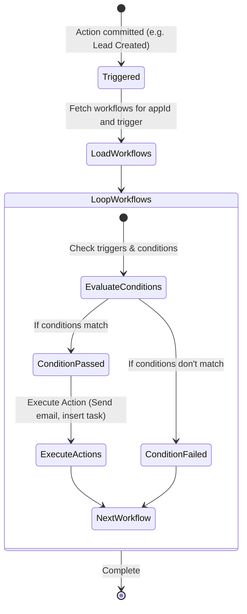

# System Architecture & Technical Specifications

This document defines the high-level system architecture, database models, file organization, runtime mechanics, and implementation designs for the AI App Generator.

---

## 1. High-Level Architecture

The system is designed on **Clean Architecture** and **Feature-Based Architecture** principles. It decouples the core platform engines from the dynamic applications rendered at runtime.

### System Flow Diagram


### Component Data Flows
1. **Application Generation Flow**:
   - The user inputs a prompt.
   - The system queries OpenAI using structured outputs to obtain a complete JSON document adhering to the App Metadata Schema.
   - The JSON is validated against a strict Zod schema. If valid, the system inserts the Tenant/App records and pages into PostgreSQL.
2. **Runtime Render Flow**:
   - A user accesses `/apps/[appId]/[pageSlug]`.
   - The loader queries the database for the Page configuration and App definitions.
   - The component registry loads the appropriate layout, injecting metadata into components (`DynamicTable`, `DynamicForm`, `DynamicDashboard`).
   - Dynamic UI components query the Dynamic API `/api/v1/apps/[appId]/entities/[entityName]` to fetch/update data.

---

## 2. Database Design & Prisma Schema

To handle 100,000+ users and millions of rows, the database uses a hybrid design.
- **Relational Tables**: Used for stable entities (Tenants, Users, Sessions, App Definitions, Page Layouts, Workflows).
- **Document Store Table (`Record`)**: A single table with a PostgreSQL `JSONB` column to store all dynamic application records (e.g., Leads, Contacts, Tasks) without running `ALTER TABLE` at runtime.

### Prisma Schema Design
```prisma
datasource db {
  provider = "postgresql"
  url      = env("DATABASE_URL")
}

generator client {
  provider = "prisma-client-js"
}

enum Role {
  ADMIN
  MANAGER
  USER
}

model Tenant {
  id        String   @id @default(uuid())
  name      String
  createdAt DateTime @default(now())
  updatedAt DateTime @updatedAt
  users     User[]
  apps      App[]
}

model User {
  id            String    @id @default(uuid())
  name          String?
  email         String    @unique
  passwordHash  String?
  role          Role      @default(USER)
  tenantId      String
  tenant        Tenant    @relation(fields: [tenantId], references: [id], onDelete: Cascade)
  createdAt     DateTime  @default(now())
  updatedAt     DateTime  @updatedAt
  sessions      Session[]
}

model Session {
  id           String   @id @default(uuid())
  sessionToken String   @unique
  userId       String
  expires      DateTime
  user         User     @relation(fields: [userId], references: [id], onDelete: Cascade)
}

model App {
  id          String     @id @default(uuid())
  name        String
  description String?
  tenantId    String
  tenant      Tenant     @relation(fields: [tenantId], references: [id], onDelete: Cascade)
  createdAt   DateTime   @default(now())
  updatedAt   DateTime   @updatedAt
  entities    Entity[]
  pages       Page[]
  workflows   Workflow[]
  records     Record[]
}

model Entity {
  id          String   @id @default(uuid())
  appId       String
  app         App      @relation(fields: [appId], references: [id], onDelete: Cascade)
  name        String   // e.g. "lead", "contact"
  displayName String   // e.g. "Lead", "Contact"
  schema      Json     // JSON schema detailing fields, validations, relationships
  createdAt   DateTime @default(now())
  updatedAt   DateTime @updatedAt

  @@unique([appId, name])
}

model Page {
  id          String   @id @default(uuid())
  appId       String
  app         App      @relation(fields: [appId], references: [id], onDelete: Cascade)
  slug        String   // e.g. "dashboard", "leads-list"
  title       String
  layout      Json     // Details structure: grid columns, nested components list
  createdAt   DateTime @default(now())
  updatedAt   DateTime @updatedAt

  @@unique([appId, slug])
}

model Record {
  id         String   @id @default(uuid())
  appId      String
  app        App      @relation(fields: [appId], references: [id], onDelete: Cascade)
  entityName String   // e.g. "lead", "contact"
  data       Json     // JSONB document representing fields (e.g. { name: "John", status: "New" })
  createdAt  DateTime @default(now())
  updatedAt  DateTime @updatedAt
  createdById String?

  @@index([appId, entityName])
}

model Workflow {
  id          String   @id @default(uuid())
  appId       String
  app         App      @relation(fields: [appId], references: [id], onDelete: Cascade)
  name        String
  trigger     Json     // { type: "record_created", entity: "lead" }
  conditions  Json     // [ { field: "status", operator: "equals", value: "converted" } ]
  actions     Json     // [ { type: "create_record", entity: "contact", data: { ... } } ]
  isActive    Boolean  @default(true)
  createdAt   DateTime @default(now())
  updatedAt   DateTime @updatedAt
}
```

---

## 3. Dynamic App JSON Specification

Below is the standard JSON Schema outputted by the AI Generator:

```json
{
  "$schema": "http://json-schema.org/draft-07/schema#",
  "title": "ApplicationMetadata",
  "type": "object",
  "properties": {
    "appName": { "type": "string" },
    "description": { "type": "string" },
    "entities": {
      "type": "array",
      "items": {
        "type": "object",
        "properties": {
          "name": { "type": "string" },
          "displayName": { "type": "string" },
          "fields": {
            "type": "array",
            "items": {
              "type": "object",
              "properties": {
                "name": { "type": "string" },
                "label": { "type": "string" },
                "type": { "type": "string", "enum": ["text", "textarea", "number", "email", "password", "select", "radio", "checkbox", "date", "file"] },
                "required": { "type": "boolean" },
                "options": { "type": "array", "items": { "type": "string" } },
                "defaultValue": { "type": "string" }
              },
              "required": ["name", "label", "type"]
            }
          }
        },
        "required": ["name", "displayName", "fields"]
      }
    },
    "pages": {
      "type": "array",
      "items": {
        "type": "object",
        "properties": {
          "slug": { "type": "string" },
          "title": { "type": "string" },
          "components": {
            "type": "array",
            "items": {
              "type": "object",
              "properties": {
                "type": { "type": "string", "enum": ["form", "table", "chart", "dashboard", "card"] },
                "entity": { "type": "string" },
                "config": { "type": "object" }
              },
              "required": ["type"]
            }
          }
        },
        "required": ["slug", "title", "components"]
      }
    },
    "workflows": {
      "type": "array",
      "items": {
        "type": "object",
        "properties": {
          "name": { "type": "string" },
          "trigger": { "type": "object" },
          "conditions": { "type": "array" },
          "actions": { "type": "array" }
        },
        "required": ["name", "trigger", "conditions", "actions"]
      }
    }
  },
  "required": ["appName", "entities", "pages", "workflows"]
}
```

---

## 4. Folder Structure (Clean Architecture & Feature-Based)

```
d:/Project/AI app Builder/
├── docs/                      # Architectural & design assets
├── prisma/                    # Schema and migrations
│   └── schema.prisma
├── src/
│   ├── app/                   # Next.js App Router (Routing & Presentation)
│   │   ├── layout.tsx
│   │   ├── page.tsx
│   │   ├── api/               # API Router Handlers
│   │   │   ├── auth/          # Auth.js configurations
│   │   │   └── v1/
│   │   │       ├── generate/  # Prompt mapping route
│   │   │       └── apps/      # Dynamic CRUD API endpoints
│   │   └── apps/              # Runtime UI Portal
│   │       └── [appId]/
│   │           ├── layout.tsx
│   │           └── [pageSlug]/
│   │               └── page.tsx
│   ├── components/            # Global UI component shell
│   │   ├── ui/                # Shadcn UI Core components
│   │   └── dynamic/           # Runtime Component Registry components
│   │       ├── DynamicForm.tsx
│   │       ├── DynamicTable.tsx
│   │       ├── DynamicChart.tsx
│   │       ├── DynamicDashboard.tsx
│   │       └── DynamicRegistry.tsx
│   ├── features/              # Feature domain modules (Domain / Application Logic)
│   │   ├── ai/                # OpenAI parsing engine, schema validators
│   │   ├── auth/              # RBAC checks, session providers
│   │   ├── csv/               # CSV importer logic
│   │   ├── git-export/        # GitHub push routines
│   │   └── workflow/          # Workflow runner evaluation module
│   ├── lib/                   # Infrastructure services (Prisma, State Store, HttpClient)
│   │   ├── db.ts              # Prisma Client wrapper
│   │   ├── store.ts           # Zustand app state store
│   │   └── i18n/              # Localization files & logic
│   └── types/                 # Standardized TypeScript interface files
```

---

## 5. Module Designs

### 5.1 AI Metadata Generator Pipeline
Using the structured output parser from OpenAI, we enforce strict JSON conformities.



### 5.2 Dynamic Form Engine
- Translates dynamic field metadata into React Hook Form controls.
- Uses dynamic validation compiling:
  ```typescript
  // Example of building Zod validation dynamically at runtime:
  const buildZodSchema = (fields: FieldMetadata[]) => {
    const shape: Record<string, z.ZodTypeAny> = {};
    fields.forEach((field) => {
      let schema: z.ZodTypeAny = z.string();
      if (field.type === 'number') schema = z.coerce.number();
      if (field.type === 'email') schema = z.string().email();
      if (field.required) {
        schema = schema.min(1, `${field.label} is required`);
      } else {
        schema = schema.optional();
      }
      shape[field.name] = schema;
    });
    return z.object(shape);
  };
  ```

### 5.3 Dynamic API Generator
Executes CRUD operations by targeting Postgres `Record` table:
- **CREATE**: Enforces dynamic Zod schema, check for tenant scope, execute workflow triggers.
- **READ**: Supports query string conversion (e.g. `/api/v1/apps/{id}/entities/{entityName}?filter_status=New&sort=createdAt:desc&page=1&limit=10`). Translates dynamic parameters into JSONB filters.
- **UPDATE**: Patches keys in the `data` JSONB object, evaluates workflow status transitions.
- **DELETE**: Deletes records within the tenant's container.

### 5.4 Workflow Engine execution mechanics


---

## 6. Engineering Tradeoffs

### JSONB vs. DDL Migrations
- **DDL Migration (Running schema changes dynamically)**: Provides native DB tables and columns, typed SQL schemas, and fast queries. However, it requires active locks on tables, is highly prone to schema migration failures under serverless loads, and easily crashes database connections when hundreds of users edit schemas simultaneously.
- **JSONB (Our Choice)**: Bypasses runtime schema alterations. Highly extensible, scales to hundreds of thousands of apps without affecting other applications. PostgreSql handles JSONB queries very fast. GIN index speeds up queries, and schema conformance is shifted to the Node.js application layer. Tradeoff: Complex queries (like joining two custom dynamic entities) require JSONB extraction syntax which is slower than native SQL tables.

---

## 7. Reliability, Testing, & Deployment Strategy

- **Reliability**:
  - Global Next.js `ErrorBoundary` captures rendering crashes.
  - Sentry/Log tail integration for tracking system health.
- **Testing**:
  - Unit tests verify core engine logic: schema parser, validation generator, and workflow engine.
  - End-to-end integration tests using Playwright/Cypress.
- **Deployment**:
  - Vercel hosting for Serverless Edge rendering.
  - Neon Serverless PostgreSQL with autoscaling features.
